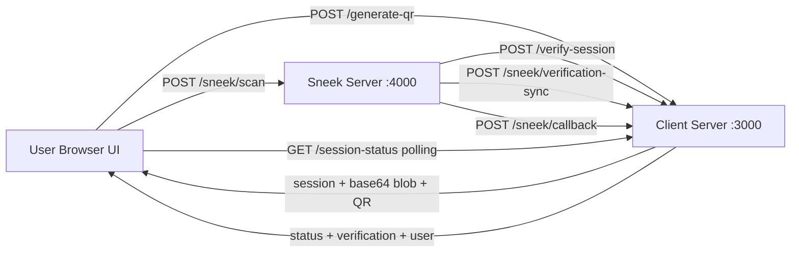
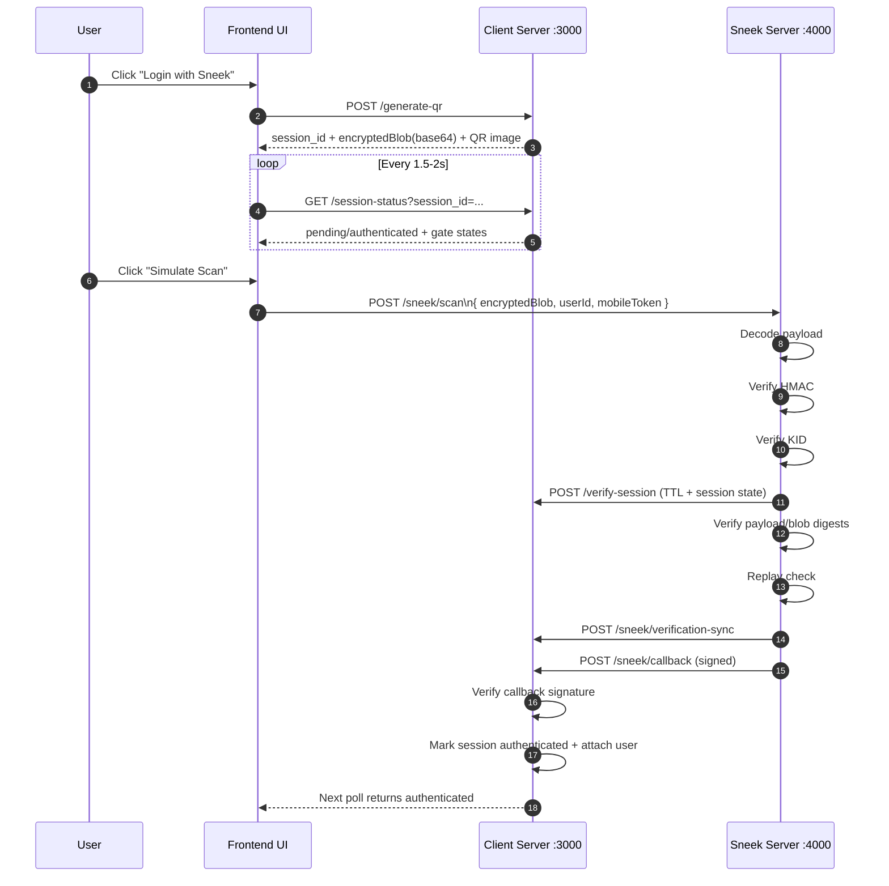
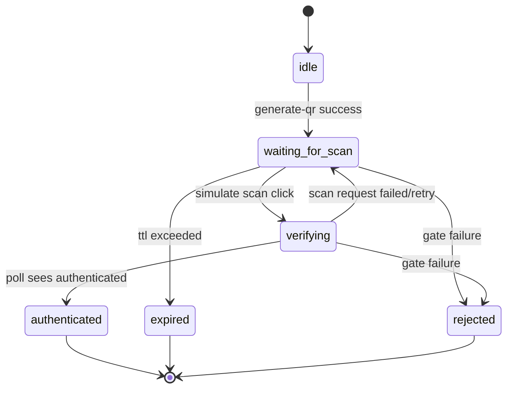
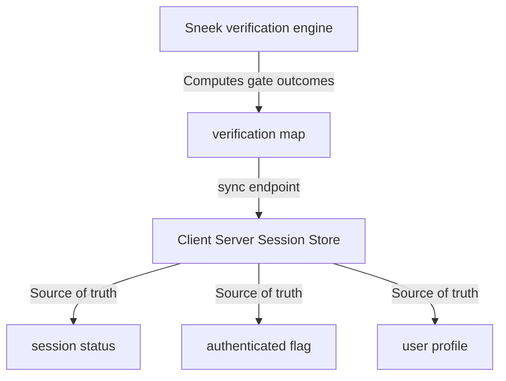
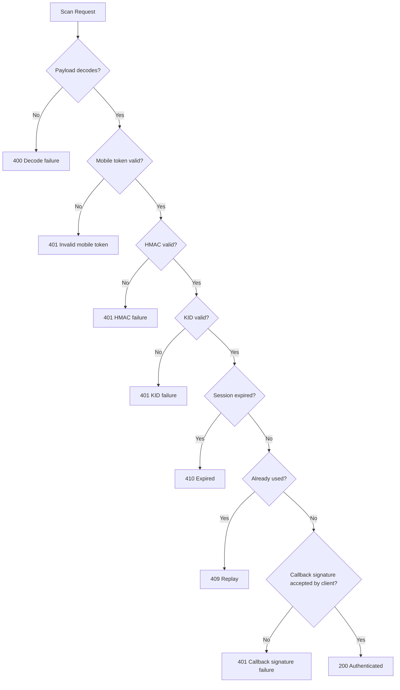

# Sneek Auth Pipeline

Detailed, presentation-ready visualization of the complete QR authentication pipeline.

---

## 1) System Overview

Sneek Auth is a distributed QR login demo with three runtime parts:

- **Frontend UI** (browser, port `3030`)
- **Client Server** (session authority, port `3000`)
- **Sneek Server** (scan + verification engine, port `4000`)

Core idea: the user logs in via QR, Sneek verifies multiple security gates, and Client Server is the source of truth that finally authenticates the session.

---

## 2) High-Level Architecture



---

## 3) End-to-End Sequence (Happy Path)



---

## 4) Frontend State Machine



---

## 5) Security Gate Map

| Gate | Checked By | Why It Exists | Typical Failure |
|---|---|---|---|
| Mobile token | Sneek | Confirms simulated mobile auth proof | `401 Invalid mobile token` |
| Payload decode | Sneek | Ensures QR blob is parseable | `400 could not decode payload` |
| HMAC (`HMAC-SHA256`) | Sneek | Payload integrity + origin-auth proof | `401 HMAC verification failed` |
| KID/origin | Sneek | Prevents origin spoofing | `401 KID verification failed` |
| Session TTL | Client introspection + Sneek handling | Prevents stale QR reuse | `410 Session has expired` |
| Replay check | Sneek + synced client state | Prevents second use of same session | `409 Replay detected` |
| Callback signature | Client | Accepts only trusted Sneek callback | `401 Invalid callback signature` |
| Cross-checks (session/payload/blob digests) | Sneek | Detects tampering across transport | `401 cross verification failed` |

---

## 6) Data Ownership and Trust Boundaries



### Important boundary decisions

- Client Server is authoritative for session lifecycle and final auth status.
- Sneek Server is authoritative for scan-time verification computations.
- Sneek does not directly mutate client memory; it syncs via HTTP.

---

## 7) API View by Service

### Frontend -> Client Server (`:3000`)

- `POST /generate-qr`
- `GET /session-status?session_id=...`

### Sneek Server -> Client Server (`:3000`)

- `POST /verify-session`
- `POST /sneek/verification-sync`
- `POST /sneek/callback`

### Frontend -> Sneek Server (`:4000`)

- `POST /sneek/scan`

---

## 8) Failure Scenario Visualization



---

## 9) Demo Script (2-3 minutes)

1. Open UI and show architecture briefly.
2. Click **Login with Sneek** -> point out generated QR + pending state.
3. Show verification board starts as pending.
4. Click **Simulate Scan**.
5. Narrate logs:
   - `[SNEEK] Scan request received`
   - `[SNEEK] Session valid`
   - `[SNEEK] HMAC verified`
   - `[SNEEK] Callback sent`
   - `[CLIENT] User authenticated`
6. Show frontend updates to **Authenticated** with user profile.
7. Show all verification gates moved to `passed`.

---

## 10) Local Run Checklist

From project root:

```bash
# terminal 1
node client-server/server.js

# terminal 2
CLIENT_SERVER_URL=http://localhost:3000 node sneek-server/server.js

# terminal 3 (frontend static host)
python3 -m http.server 3030 --directory public
```

Open: [http://localhost:3030](http://localhost:3030)

---

## 11) Demo-Only Notes

- Uses **base64 encoding** for payload transport (not production encryption).
- Uses in-memory store (no DB persistence).
- Designed to explain protocol and gate sequencing clearly.
- Good for architecture + security-flow interviews and demos.

---

## 12) Final Sign-Off Matrix

Latest end-to-end validation snapshot:

| Scenario | Expected Outcome | Observed Outcome | Result |
|---|---|---|---|
| Happy path | Session authenticates, user attached, all gates pass | `200` scan, session `authenticated`, all gates `passed` | ✅ PASS |
| Expired session | Scan rejected after TTL | `410` + `Session has expired.` | ✅ PASS |
| Replay attack | Second scan rejected | `409` + replay error | ✅ PASS |
| HMAC tamper | Integrity check failure | `401` + `HMAC verification failed.` | ✅ PASS |
| KID mismatch | Origin/KID failure | `401` + `KID verification failed.` | ✅ PASS |
| Invalid mobile token | Mobile token rejection | `401` + `Invalid mobile token.` | ✅ PASS |
| Callback signature tamper | Client rejects callback | `401` + `Invalid callback signature.` | ✅ PASS |

**Overall sign-off:** `7 / 7` scenarios passed, demo-ready for the current scope.
